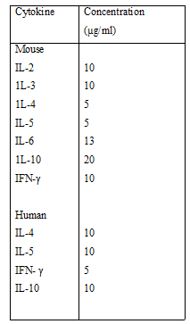
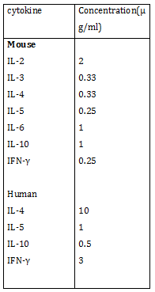

#### Materials Required
 
•	purified cytokine-specific primary antibody

•	Coating buffer

•	Wash solution: PBS containing 0.25% (v/v) Tween 20

•	Blocking solution: PBS containing 5% (w/v) BSA

•	ELISPOT dilution buffer: PBS containing 1% (w/v) BSA

•	Cytokine-secreting cells

•	Labelled secondary cytokine-specific antibody in ELISPOT dilution buffer.

•	Detecting antibody or protein appropriate for cell type 

•	Substrate (BCIP solution)

•	Complete RPMI-10 medium 

•	Phosphate-buffered saline (PBS)

•	96-well nitrocellulose-backed microtiter plates 

•	Humidified 370C, 5% CO2 incubator
 
 
 #### Reagents and Solutions
 
•	PBS (Phosphate buffered saline) : Dissolve 8g Sodium chloride,0.2g potassium chloride,1.15 g Disodium hydrogen peroxide and .2g potassium dihydrogen phosphate in 800 ml deionized water and make upto 1000ml.

•	Wash solution (PBS containing 0.25% (v/v) Tween 20) : mix 1.25 ml Tween 20 with 500 ml of PBS.

•	Blocking solution: PBS containing 5% (w/v) BSA. : Mix 5 g BSA( bovine serum albumin) in 100 ml PBS.

•	Dilution buffer (PBS containing 1% (w/v) BSA) : Mix 1g BSA in 100 ml PBS.

•	Complete RPMI- 10  medium: RPMI 1640 medium containing: 10%FBS, heat-inactivated 1 hr at 560C,,2 mM L-glutamine,,50 µM 2-ME (2-mercaptoethanol), 100 µg/ml streptomycin sulfate
 

### Procedure
 
•	Coat nitrocellulose-backed microtiter plate with cytokine-specific primary antibody : Add an optimal amount of purified cytokine-specific primary antibody in coating buffer in a  volume of 50 µl( 15µg/ml) to wells of nitrocellulose-backed microtiter plate.
 
•	Cover plate with a  plastic wrap. Incubate 2 hr at room temperature.
 
•	Discard coating antibody. Rinse plate three times with wash solution (200 µl per rinse).
 
•	Shake excess liquid from plate and pat bottom of plate with dry absorbent paper.
 
•	Add 200 μl blocking solution to each well to saturate remaining binding sites.
 
•	Incubate 30 min at 37°C.
 
•	Discard blocking solution, wash plate three times with wash solution (200 μl per wash).
 
•	Shake excess liquid from plate, and pat bottom of plate with dry absorbent paper.
 
•	Add 100 μl  complete RPMI-10 and incubate 10 min at room temperature.
 
•	Discard liquid and pat bottom of plate with dry absorbent paper
 
•	Add 100 μl cell suspension 106  cells/ml in complete RPMI -10 medium.
 
•	Add 100µl mitogens, antigens, or other stimulus to the cells eg : PHA to 5 µg/ml. Maintain unstimulated cells(medium alone) to be used to assess background cytokine production and in vivo activation.
 
•	Incubate cells 6 to 24 hr on a level surface in a humidified 37°C, 5% CO2 incubator.
 
•	Wash plate extensively with wash solution (200 μl per wash), shake excess liquid from plate, and pat dry.
 
•	 Add 50 μl labeled cytokine-specific secondary antibody in ELISPOT dilution buffer to each well. Incubate 2 hr at room temperature.
 
•	Discard the antibody and wash plate six times with wash solution (200 μl  per wash).
 
•	Shake excess fluid from plate and pat dry
 
•	Add 50 μl alkaline phosphatase–labeled detecting antibody or protein and incubate 2 hr at room temperature.
 
•	Wash plate six times with washing buffer and pat dry.
 
•	Add 50 μl BCIP solution to each well and incubate 5 to 30 min at room temperature until color (blue spots) develops.
 
•	Wash three times with distilled water (200 μl per wash) and air dry.
 
•	Quantitate spots using a ELISPOT reader.
 

#### Real experimental differences
 
•	The optimal concentration of cytokine-specific primary antibody should be determined in advance It is generally necessary to use concentrations 5- to 10-fold higher than those used in conventional ELISA assays (e.g., 5 to 10 µg/ml).The antibodies are usually diluted in PBS (pH 7.2 to 7.4) or borate buffer (pH 8.4). Because each antibody used for coating has different binding characteristics, it is necessary to determine the optimal coating conditions for each antibody.

•	The appropriate concentration of secondary cytokine-specific antibody must be determined in advance (see suggested concentrations) and has to be diluted in  PBS containing 1% (w/v) BSA.
 
       
  
 
•	For stimulus of the incubated cells  mitogens ,antigens or other stimulus is added  . Stimulation can occur prior to addition of the cells or during incubation on the plate. For standard ELISPOT analyses,  the stimuli can be added directly  to  the cells while  in  the nitrocellulose-backed microtiter plates. Also a  protein  inhibitor  such  as  cycloheximide  (100  g/ml)  can  be  used  as  an additional  control. Cycloheximide  should  be  added  to  3  or  4  replicate wells,  for  both unstimulated and stimulated cells, at the initiation of culture.

 
•	The cells are incubated  for  6 to 24 hr on a level surface in a humidified 37°C, 5% CO2 incubator. The  length of  incubation depends upon  the  type of  cell  involved and  the nature of  the stimulus. For many cytokines, there is little spontaneous production; thus for the majority of cytokines, a stimulus will be necessary to enumerate cells capable of secreting a given cytokine. Each cytokine has its own specific kinetics, and appropriate conditions must be determined for a given set of stimuli. If the incubation is too short, reduced numbers of spots will  result.  If  the  incubation  is  too  long,  there will  be  an  increase  in  the  assay background.

