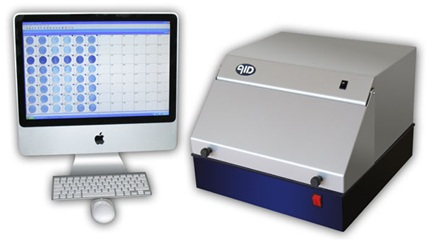

### Principle
 
Enzyme linked Immunospot Assay (ELISPOT) is an ELISA-based technique that enables detection and enumeration of Ig and cytokine secreting cells at single cell level. It is a modification of ELISA antigen –capture assay or Sandwich ELISA assay which  provides a powerful tool for measuring of T-cell responses.  Populations of T-cells are stimulated with the antigen of interest, and then allowed to settle onto a plastic plate coated with antibodies to the cytokine that is to be assayed.  If an activated T cell is secreting that cytokine, it is captured by the antibody on the plastic plate,  After a period the cells are removed and a second antibody to the cytokine is added to the plate to reveal a circle of bound cytokine surrounding the position of each activated T cell;  counting ach spot and knowing the number of T cell originally added to the plate allows a simple calculation of the frequency of T cells secreting that particular cytokine.  A modification of the ELISPOT technique, the reverse ELISPOT, using surface coated with antibodies can be used to detect virtually any cell-secreted product provided that an antibody is available and the ligand is secreted in insufficient quantities to be detected. The quantity of the secreted antigen or antibody can be roughly estimated with this assay format. Sensitivity of the ELISPOT assay is such that cells producing as few as 100 molecules of specific protein per second can be detected. These assays take advantage of the relatively high concentration of a given protein (such as a cytokine) in the environment immediately surrounding the protein-secreting cell. These cell products are captured and detected using high-affinity antibodies. Reverse ELISPOT assays were designed for the detection of IL-1,IL-2,IL-4,IL-5,IL-6,IL-10, IFN –γ,GM-CSF,TNF-α,TNF-β and Granzyme B.

&nbsp;

 Elispot assay can also be used to detect specific antibody secretion by B cells, by using antigen coated surfaces to trap specific antibody and labeled anti-immunoglobulin to detect the bound antibody.

&nbsp;

### Different stages in ELISPOT Assay
 
Elispot method   employs the sandwich assay approach of the enzyme-linked immunosorbent assay (ELISA), with some variations. The ELISPOT assay involves five specific steps:
 

(1) Coating a purified cytokine-specific antibody to a nitrocellulose-backed micro titer plate.
 

(2) Blocking the plate to prevent nonspecific absorption of any other proteins.
 

(3) Incubating the cytokine-secreting cells at several different dilutions.
 

(4) Adding a labeled second anti-cytokine antibody; and
 

(5)Detecting the antibody-cytokine complex.

&nbsp;
 

#### coating a purified cytokine-specific antibody to a nitrocellulose-backed micro titer plate: 

The assay make use of 96 well plates backed with membranes such as  polyvinylidene difluoride (PVDF) or  nitrocellulose. NC and  PVDF membranes were developed to serve the needs of sterile filtration applications. The porosity and binding properties of these two membrane types enabled them to be used in two extremely important research applications; DNA and protein blotting. Both polyclonal antibody and monoclonal antibody can be used in ELISPOT for either antigen capture or antigen detection.  ELISPOT can use capture and detection antibodies that were raised against the entire antigen molecule or against a portion of antipeptide antibodies.
 

&nbsp;

#### Washing step:

The purpose of washing step is to remove unbound antibodies. Plates can be washed with phosphate buffered saline(PBS) or Tris -buffered saline (pH 7.4) with detergent such as 0.05% (v/v) Tween20.
 

&nbsp;

#### Blocking step: 

Blocking solution(PBS containing 5% (w/v) BSA or FCS) can be used to prevent nonspecific absorption of any other protein.
 

&nbsp;

#### Incubating the cytokine-secreting cells: 

The cells are cultured in designated  plate and transferred into ELISPOT plates or cells are stimulated and cultured directly in ELISPOT plates.The cells can be stimulated one way or other,but the experimenter should keep in mind that cells cultured and stimulated outside ELISPOT plate need to be transferred into a fresh culture medium before being plated into an ELISPOT plate to avoid background staining. Cells of interest are plated out at varying densities in the presence or absence of specific stimulus and then incubated at 37°C to allow relevant cytokine induction and secretion. During incubation, the cells  become  activated  by  the stimulus and start to produce and secrete cytokine that binds to the capture antibody.
 

&nbsp;

#### Adding a labeled second anti-cytokine antibody: 

Detection antibody which may be directly conjugated with enzyme or biotinylated is added. If using biotinylated detection antibody, a streptavidin-enzyme conjugate is added.  Horseradish peroxidase (HRP) or alkaline phosphatase(AP) can be used as streptavidin conjugates. By combining HRP and AP, it is possible to develop an ELISPOT assay for simultaneous detection of two different cell- secreted molecules.   
 

&nbsp;

#### Add substrate: 

Finally a substrate added will form a colored spot at the location of the secreting cell. Regardless of which enzyme conjugate is used,their corresponding substrates should produce intense and stable colors.  HRP substrate such as AEC(3- amino-9-ethylcarbazole) forms intense red color spots and  another HRP SUBSTRATE DAB( 3,3’-diaminobenzidine) produces brown color spots.One of the most frequently used substrates for alkaline phosphate is a mixture of BCIP(5-bromo-4-chloro-3-indolylphosphate p-toluidine salt) and NBT (Nitroblue tetrazolium chloride) which forms intense Black blue spots.  Plates are scanned and evaluated for the number of antigen specific cells using powerful imaging system, the latest model of ELISPOT reader.
 

&nbsp;

#### Quantification of spots:  

After finishing the assay, spots can be counted either manually or by using computer- aided image analysis. Manual counting is performed under the stereomicroscope but it is tedious and time consuming but appears to be of higher sensitivity, allowing the experimenter to identify faint spots of smaller sizes and decide whether spot is real or an artifact. Computer aided quantification can be performed using either semi automated or fully automated systems. 
Applications
 

. To investigate specific immune responses in various diseases including infections, cancer, allergies and autoimmune diseases.
 

. For immunological monitoring of cancer vaccine trials and has gained increased application as a measure of specific T cell activation. It directly measure the release of a cytotolytic protein, supported detection of low frequency tumor-specific CTL (cytotoxic T-lymphocyte).
 

. It is used to define vaccine efficacy by measuring the capacity to elicit potent T-cell responses.
 

. The assay can be used to discriminate between different subsets of activated T cells ie T-helper (Th) 1 type cells are characterized by their production of IFN-γ, IL-2 and TNF-α whereas other cytokines like IL-4, IL-5 and IL-13 are typically produced by Th2 cells.
 

. The ELISpot method has also been exploited for diagnostic purposes. For example, this  test which detects patients with active or latent tuberculosis infection is measuring the presence of T cells responding to defined antigens from Mycobacterium tuberculosis by IFN-γ secretion.
 

### Applications
 

1. To investigate specific immune responses in various diseases including infections, cancer, allergies and autoimmune diseases.
 

2. For immunological monitoring of cancer vaccine trials and has gained increased application as a measure of specific T cell activation. It directly measure the release of a cytotolytic protein, supported detection of low frequency tumor-specific CTL (cytotoxic T-lymphocyte).
 

3. It is used to define vaccine efficacy by measuring the capacity to elicit potent T-cell responses.
 

4. The assay can be used to discriminate between different subsets of activated T cells ie T-helper (Th) 1 type cells are characterized by their production of IFN-γ, IL-2 and TNF-α whereas other cytokines like IL-4, IL-5 and IL-13 are typically produced by Th2 cells.
 

5. The ELISpot method has also been exploited for diagnostic purposes. For example, this  test which detects patients with active or latent tuberculosis infection is measuring the presence of T cells responding to defined antigens from Mycobacterium tuberculosis by IFN-γ secretion.
 

